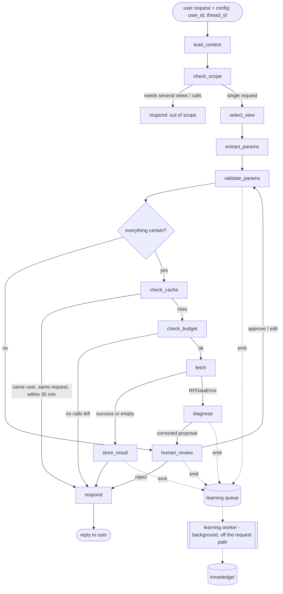

# rp_agent: Specification

**Status:** v0.6, implemented in this repository (`src/rp_agent/`, `tests/`, `scripts/eval_learning.py`). Review decisions are recorded in §14.
**Purpose:** A LangGraph agent that handles **one specific data request**. It turns the user's plain-language request into **one** correct, economical `rpdata.get_data` call on **one** view. It keeps the resulting DataFrame in a per-user store and hands back an ID. It learns from each call and each human review, so over time it needs fewer human checks and makes fewer bad calls.

---

## 1. Goals and non-goals

### Goals
- **Retrieve data** from `rpdata` for a single request such as *"Tier1 breaches on the equity desks on 28 Aug"*.
- **One request, one view, one call.** Each request resolves to exactly one view and at most one automatic `get_data` call. The only exception is one human-approved retry after a failed call, so no request makes more than 2 calls.
- **Pick a view.** The view must be one of `rpdata.list_views()`. If the agent is unsure, a human reviews the choice.
- **Pick parameters.** Every mandatory parameter must be filled. Values are validated before the call with `rpdata`'s own parameter validators. If the agent is unsure, a human reviews the parameters.
- **Treat `get_data` as expensive.** Call it only when the view and parameters are settled. Never call it to explore, and never call it for data the same user retrieved in the last 30 minutes.
- **Store every result** in an in-memory store scoped to the user. Each entry has a dataset ID and records the exact view, the exact parameters and the retrieval time. All four are returned to the user.
- **Learn.** Build up short notes on views and parameters (formats, quirks, user vocabulary, worked examples) while the agent runs. Load them on later requests so the agent gets it right first time more often and needs human review less often.

### Non-goals (v1)
- **No changes to `rpdata`.** `rpdata` is a dependency, not something this project edits. Changes this project would like are listed in §12 as proposals. They need explicit approval before anyone makes them.
- **No multi-call or multi-view requests.** A request that needs several views or several calls is out of scope. A separate orchestrator agent will split such work into single requests for this agent.
- **No filtering, analysis or reuse of subsets after extraction.** A separate agent handles post-extraction filtering and analysis. This agent does not serve a narrower request by filtering a broader stored dataset. It only reuses exact matches (§7.3).
- No persistent data store. The store is in memory and is lost when the process ends. The interface allows a persistent store later.
- No joins across views.
- No access control beyond scoping the store by `user_id`.

---

## 2. Technology

| Item | Choice |
|---|---|
| Language | Python ≥ 3.10 (matches `rpdata`) |
| Agent framework | `langgraph` (state graph, checkpointer, `interrupt` for human review) |
| LLM interface | `langchain-core` chat models with structured output (Pydantic schemas) |
| LLM | `langchain_openai.ChatOpenAI`, configured with a model name, API key and base URL (`RP_AGENT_MODEL`, `RP_AGENT_API_KEY`, `RP_AGENT_BASE_URL`), so any OpenAI-compatible endpoint can be used. Structured output uses `json_schema` by default; `function_calling` or `json_mode` can be set for endpoints without JSON-schema support (`RP_AGENT_STRUCTURED_OUTPUT`) |
| Data dependency | `rpdata` as a package dependency, e.g. `rpdata @ git+https://github.com/PaeoniaCommon/rpdata.git@<tag>` |
| Other runtime deps | `pandas`, `pydantic` |
| Dev deps | `pytest`, `ruff` |
| Packaging | `pyproject.toml`, `src/` layout (as in `rpdata`) |

---

## 3. Key design decisions

1. **`get_data` is not an LLM tool.** A free-form ReAct agent that can call `get_data` whenever it likes would over-query. Instead the agent is an explicit LangGraph state graph. The LLM is used only for judgement: choosing the view, extracting parameters and writing notes. Every call to `get_data` goes through one deterministic node (`fetch`), which sits behind the validation, cache and budget checks.
2. **One gateway to `rpdata.get_data`.** Only `DataGateway` (§6.1) calls `rpdata.get_data`. It enforces the one-call budget and logs every call. Tests put a spy on it to count calls.
3. **Deterministic checks wherever possible.** Mandatory parameters, view names, parameter validation (via `rpdata`'s `Parameter.validate`), cache lookup and budget are plain Python, not LLM judgement.
4. **Human in the loop only when uncertain.** If the agent is sure of the view and every parameter, it calls `get_data` with no confirmation step. If anything is uncertain, it pauses (LangGraph `interrupt`) and shows a human the proposed call, with the uncertain parts marked. The human approves, edits or rejects it (§5.6).
5. **DataFrames never enter the LLM context.** The LLM sees dataset metadata (ID, view, params, shape, columns), never the rows. This keeps prompts small and data out of the model.
6. **The store is per user.** `user_id` comes from the chat config. The 30-minute reuse applies across all of that user's conversations, and never across users.
7. **Learning happens at runtime.** Notes are plain Markdown files that the running agent creates and updates (§8). They are not committed to the repo.
8. **Learning never delays the user.** Graph nodes only *emit* learning events onto an in-process queue, which takes microseconds and never blocks. A background worker does all learning work (LLM phrasing, merging, file writes, value-index updates) in parallel. The reply goes to the user without waiting for any of it (§8.6).

---

## 4. What the agent uses from `rpdata` (today)

The agent relies only on the public `rpdata` API:

| Call | Used for | Cost |
|---|---|---|
| `rpdata.list_views()` | The only allowed view names | Free, cached at start-up |
| `rpdata.get_view(name)` | `description`, `mandatory_params`, `optional_params`, `columns` | Free, cached at start-up |
| `rpdata.list_params()` | `Parameter` metadata: `dtype`, `description`, `format`, `allowed_values` | Free, cached at start-up |
| `Parameter.validate(view_name, value)` | Pre-flight check of each parameter's type, format and closed-list value (including unknown nodes). Returns the normalised value or raises `InvalidParameterError` / `UnknownNodeError` | Free: no data query |
| `rpdata.get_data(view, **params)` | The retrieval itself | **Expensive**: budgeted, cached, logged |
| `rpdata.RPDataError` and subclasses | Classifying failures for learning (§8.3) | n/a |

The first three calls make up the **catalogue**. It is built once at start-up and shown to the LLM in compact form.

**What `rpdata` does not check before `get_data` today** (see §12):
- `Parameter.validate` checks **one parameter at a time**. `get_data` also checks rules across parameters: `previous_date ≤ current_date`, `min_utilisation ≤ max_utilisation`, and the MASTER timeout rule. There is no public function for these, so the agent reimplements them from notes (§5.5, step 5) until R1 exists.
- The parameter metadata has no defaults (for example, `max_depth` defaults to `'max'`).

---

## 5. Agent flow

### 5.1 Graph



Solid arrows are the request path. Dotted arrows are learning, which runs **in parallel** and is not on the request path: nodes emit learning events onto a queue without waiting, and a background worker processes them (§8.6). No node on the request path waits for learning. For readability, not every emitting node is drawn.

### 5.2 Nodes

| Node | Kind | Responsibility |
|---|---|---|
| `load_context` | Deterministic | Load the catalogue, the general notes and the view-selection notes |
| `check_scope` | LLM + check | Confirm that the request can be met by one call on one view. If not, reply that this agent handles one data request at a time and name the parts, without calling `get_data`. (Splitting is the orchestrator's job.) To keep latency down, this single structured LLM call also proposes the view (§5.3) |
| `select_view` | Deterministic | Apply the checks in §5.3 to the view proposed by `check_scope`. The view must be in `list_views()`, which is enforced by an enum in the schema and checked again in code |
| `extract_params` | LLM + check | Propose the chosen view's parameters with a certainty flag on each (§5.4). Loads the notes for that view and its parameters only |
| `validate_params` | Deterministic | Pre-flight checks (§5.5). No `get_data` call |
| `human_review` | `interrupt` | Show the proposed call with its uncertain items marked; take approve / edit / reject (§5.6) |
| `check_cache` | Deterministic | Look up the user's recent datasets by canonical request (§7.3) |
| `check_budget` | Deterministic | Enforce the call limit (§6.2) |
| `fetch` | Deterministic | Call `DataGateway.fetch` (the only `get_data` path) |
| `store_result` | Deterministic | Save the DataFrame and metadata under the user, and get a dataset ID. Runs in the same step as `fetch`, so the DataFrame never enters the checkpointed graph state |
| `diagnose` | Deterministic + LLM | Classify the `RPDataError`, emit a learning event, and build a corrected proposal for human review (§6.3) |
| `respond` | Template | Reply with the dataset ID, view, params, retrieval time, whether it was reused, and the shape (§9) |
| *(background)* `LearningWorker` | LLM + check | Not a graph node. Consumes learning events and writes, merges, confirms or demotes notes and value indexes (§8, §8.6) |

### 5.3 View selection

The LLM gets the user request, the catalogue (name, description, mandatory and optional params, columns for each view), the view-selection notes and past worked examples. It returns:

```python
class ViewChoice(BaseModel):
    view: Literal[<names from rpdata.list_views()>] | None
    confidence: Literal["high", "medium", "low"]
    alternatives: list[str]          # other plausible views, also from list_views()
    reason: str                      # one sentence, shown in human review and logs
```

**The view is certain** only if all of these hold: `view` is set, `confidence == "high"` and `alternatives` is empty. A note or worked example that maps this kind of request to a view, or a view named explicitly and correctly by the user, counts as high confidence. Otherwise the view is marked uncertain for human review. The reviewer can only pick from `list_views()`.

### 5.4 Parameter extraction

The LLM gets the request, the view's parameter metadata (dtype, description, format), the acceptable values for each parameter in a form that depends on how many there are (§8.4: the full list for short lists, a shortlist of likely candidates for long ones), the notes for the view and each of its parameters, and the current date. It returns one entry per parameter it wants to set:

```python
class ParamValue(BaseModel):
    name: str                        # must be in the view's mandatory + optional params
    value: str | int | float | None  # None = mandatory but no value could be found
    source: Literal["user_explicit", "user_implied", "note", "default", "guess"]
    note_ids: list[str]              # notes relied on, for confirming or demoting them later
    confidence: Literal["high", "medium", "low"]

class ParamExtraction(BaseModel):
    params: list[ParamValue]
    questions: list[str]             # anything the model itself is unsure about
```

**A parameter is uncertain** if any of these hold, and it is then marked for human review:
- It is mandatory and has no value. The agent never invents a value for a mandatory parameter.
- `source == "guess"` or `confidence != "high"`.
- It was normalised in a way that is not `certain` (§5.5).
- It relies on a relative date ("last week", "latest") that notes place outside the data period. The call would only return an empty DataFrame.
- A note says the request as it stands will fail (for example, the MASTER timeout) and a filter would have to be added. The agent proposes the filter but never adds it without review, because it changes the result.

Optional parameters are set only when the request implies them. The agent does not add filters the user did not ask for.

### 5.5 Parameter validation (pre-flight, no `get_data`)

`ParamValidator` runs these checks and collects every problem, not just the first:

| # | Check | Source of truth | On failure |
|---|---|---|---|
| 1 | View is in `list_views()` | `rpdata` | Mark the view uncertain |
| 2 | No parameter outside the view's mandatory + optional list | `rpdata.get_view` | Drop it and mark it for review |
| 3 | All mandatory parameters present | `rpdata.get_view` | Mark uncertain |
| 4 | **Each parameter passes `Parameter.validate(view, value)`** (type, format, closed lists including `node`, `limit_level`, `risk_factor`) | `rpdata.list_params` | See below |
| 5 | Rules across parameters: `previous_date ≤ current_date`, `min_utilisation ≤ max_utilisation`, the MASTER timeout rule, and any other rules learned from notes | Knowledge notes (§8), replaced by `rpdata.validate_params` when it exists (R1) | Mark uncertain, with a proposed fix |

**When `Parameter.validate` rejects a value**, the agent tries a normalisation:
- It is **certain** if there is exactly one candidate that differs only by case or whitespace and is in the parameter's known values: the full `allowed_values` list, or the learned value index for parameters with long lists (§8.4) (for example `tier1` → `Tier1`, `equities` → `EQUITIES`); or if exactly one simple case or whitespace variant of the value (upper, lower, title case, spaces removed) passes `Parameter.validate`, which lets the very first `node="equities"` be fixed before any value is learned; or if the fix is an unambiguous date reformat (`2026/07/01` → `2026-07-01`, since rpdata's format is `yyyy-mm-dd`), or a `certain` note gives the rule (for example, the users' day/month order). The candidate must then pass `Parameter.validate`. The change is applied, and reported in the reply.
- Otherwise it is **uncertain** (for example, `EQUITY` could be `EQUITIES` or an `EQ_*` node; `01/07/2026` could be 1 July or 7 January). The failed value, the validator's error message and the candidate values go to human review.

A normalisation that passes validation is recorded as a note (§8.3), so next time the LLM proposes the right value first.

**Not every parameter can be fully validated.** `limit_id`, `limit_group` and `user_id` have a regex format but no closed list; `Parameter.validate` checks the format, but an unknown value that matches the format returns an empty DataFrame, not an error. Such values are accepted if the user gave them explicitly.

`validate_params` uses the **normalised** values returned by `Parameter.validate` only to decide validity. The values sent to `get_data` are the agent's own values after any normalisation above (for example, dates stay `yyyy-mm-dd` strings, because `get_data` rejects `datetime.date` objects).

### 5.6 Human review

`human_review` is a LangGraph `interrupt`. It runs **only** when something is uncertain after §5.3–§5.5, or after a failed call (§6.3). The payload shows the whole proposed call, not only the questions, so the reviewer checks it in one go:

```
I need you to check this before I query.

  View:    ViewUtilisations                      ✓
  Params:  node          = ?  (needed)           "equity desk" is not a known node.
                                                  Closest matches: EQUITIES, EQ_EMEA, EQ_US, EQ_APAC
                                                  (or type another node)
           current_date  = '2026-08-28'          ✓
           limit_level   = 'Tier1'               ✓
           min_utilisation = 100                 ⚠ inferred from "breaches"

Reply "ok" to approve, give corrections (e.g. "node EQUITIES"), or "cancel".
```

Options shown in a review depend on the parameter's value domain (§8.4). A short closed list (such as `limit_level`) is shown in full. A long list (such as `node`) is shown as a shortlist of at most 10 closest matches, plus free text. Whatever the reviewer types is still checked with `Parameter.validate`.

- **Approve:** the proposal goes back through `validate_params`. Items the reviewer approved become certain for this request.
- **Edit:** the reviewer's values replace the proposal's, and are validated again. Items the reviewer did not change are treated as approved, as with "ok". What the human says always beats notes and the LLM's proposal. A reply that is not "ok", "cancel", a view name, an option or `name value` pairs is interpreted by the LLM into the same approve / edit / cancel form.
- **Reject / cancel:** no call is made, and the request ends.
- If validation still finds an uncertain item after an edit, the agent asks again. It never calls `get_data` with an uncertain item.

The reviewer is by default the end user in the conversation. The reviewer is modelled as a separate role in the interrupt payload, so an orchestrator or an operator can take the role later.

---

## 6. Calling `get_data`

### 6.1 `DataGateway`
- The only code path that calls `rpdata.get_data`.
- Passes parameters as keyword arguments exactly as stored in the canonical request (§7.3), so what is stored is exactly what was sent.
- Records each call in `logs/get_data_calls.jsonl`: timestamp, `user_id`, thread ID, view, params, outcome (`ok`, `empty`, `error`), error class and message, duration, and row count.
- Exposes counters that tests and metrics can read.

### 6.2 Budget

| Setting | Default | Meaning |
|---|---|---|
| `max_auto_calls_per_request` | 1 | The agent makes at most one `get_data` call per request on its own |
| `max_calls_per_request` | 2 | Hard cap. A second call is only possible after a failed first call **and** a human approving a corrected proposal (§6.3) |

The agent never retries by itself. When the budget is used up, it does not call `get_data`. It explains what failed and ends the request.

### 6.3 Handling errors and empty results

Pre-flight validation (§5.5) should stop almost all parameter errors, so a failed call mainly comes from the MASTER timeout (until R1) or from a rule the agent has not learned yet.

| Outcome | Example | Agent behaviour |
|---|---|---|
| `UnknownViewError`, `UnexpectedParameterError`, `MissingParameterError` | should never happen after §5.5 | Treat as a bug: log it, report it, end the request |
| `InvalidParameterError` / `UnknownNodeError` | a rule across parameters not yet learned | Write a note from the error message. Send a corrected proposal to human review |
| `ViewTimeoutError` | `node='MASTER'` with no other filter | Write a note about the rule. Send a proposal to human review that suggests filters (for example an integer `max_depth`, or a `risk_factor`). The filter is never added without review |
| Empty DataFrame | weekend date, date outside the data period, node with no limits | This is a valid result. Store it and return its ID, and say it is empty. Draft a note if the cause is identifiable (for example, a weekend or out-of-period date). Do not retry |
| Any other exception | | Do not retry. Log it and report it |

If the human approves the corrected proposal, it goes back through `validate_params` → `check_cache` → `check_budget` → `fetch`, within the hard cap of §6.2.

---

## 7. Data store

### 7.1 Interface

```python
class DataStore(Protocol):
    def put(self, user_id: str, df: pd.DataFrame, request: CanonicalRequest,
            retrieved_at: datetime, original_request: str,
            thread_id: str = "", cache_key: str = "") -> DatasetRecord: ...
    def get(self, user_id: str, dataset_id: str) -> DatasetRecord: ...     # KeyError if unknown to this user
    def get_df(self, user_id: str, dataset_id: str) -> pd.DataFrame: ...
    def find_recent(self, user_id: str, cache_key: str,
                    within: timedelta, now: datetime) -> DatasetRecord | None: ...
    def list(self, user_id: str) -> list[DatasetRecord]: ...
```

v1 ships `InMemoryDataStore`: a dict keyed by `user_id`, held by the agent instance. It is shared by all of a user's threads (conversations) in that process, and a user can never see or reuse another user's records. It takes an injectable clock for tests.

### 7.2 Record

| Field | Type | Notes |
|---|---|---|
| `dataset_id` | `str` | `ds_` plus 8 random hex characters, e.g. `ds_7f3a2c91`. Unique within the store |
| `user_id` | `str` | Owner, from the chat config |
| `view` | `str` | Exact view name passed to `get_data` |
| `params` | `dict` | Exact parameters passed to `get_data` (after normalisation) |
| `retrieved_at` | `datetime` | Time `get_data` returned, timezone-aware UTC. Shown to the user in ISO 8601 |
| `row_count` | `int` | |
| `columns` | `tuple[str, ...]` | |
| `thread_id` | `str` | Conversation that made the call, for audit |
| `original_request` | `str` | The user's wording, for audit and for learning examples |
| `df` | `pandas.DataFrame` | Stored as returned. Callers get a copy, so the stored frame cannot be changed |

### 7.3 Canonical request and the 30-minute reuse rule

- `CanonicalRequest` = `(view, params)`. `params` drops `None` values, sorts keys, and normalises types (for example, `85` and `85.0` for utilisation become the same value). The cache key is a stable JSON serialisation of it.
- **Reuse rule:** before any `get_data` call, `check_cache` calls `find_recent(user_id, request.key(defaults), within=30 min, now)`. If the **same user** has a record, from **any** of their conversations, whose `retrieved_at` is within the last 30 minutes, the agent returns that record's ID, view, params and retrieval time, says it was reused, and **does not** call `get_data`.
- The window is measured from the original `retrieved_at`. Reusing a record does not refresh it.
- The 30-minute window only controls reuse. Older records stay retrievable by ID until the process ends.
- If the user explicitly asks for fresh data ("refresh", "re-pull"), the cache is skipped and a new record is created. The old one is kept.
- **Only exact matches are reused.** Equivalences such as "leaving out `max_depth` equals `max_depth='max'`" are applied only when they are recorded as `certain` equivalence notes (§8.1). A request is never served by filtering a broader stored dataset. Post-extraction filtering belongs to a separate agent.

---

## 8. Learning

### 8.1 What is learned

| Kind | Example | Used by |
|---|---|---|
| Format rule | "`current_date` must be a `yyyy-mm-dd` string; `2026/07/01` is rejected" | `extract_params`, `validate_params` |
| Normalisation | "Node names are upper case; `equities` → `EQUITIES` is safe" | `extract_params`, `validate_params` |
| Value domain | "`node` is a closed list that `rpdata` does not publish" (§8.4) | how values are stored, shortlisted and offered |
| Known values (long lists only) | Values that passed `Parameter.validate`: `EQUITIES`, `EQ_EMEA`, … Kept in a value index, not in the Markdown notes (§8.4) | `extract_params` (shortlist), `validate_params` (normalisation), `human_review` (options) |
| User vocabulary / aliases | "'equity desk' → `node=EQUITIES`"; "'breaches' → `min_utilisation=100`" | `extract_params` |
| View-selection hints | "Requests about 'utilisation', 'usage' or 'breach' → `ViewUtilisations`" | `select_view` |
| Rules across parameters | "`node=MASTER` with no filter other than dates times out; an integer `max_depth` or any other filter avoids it" | `extract_params`, `validate_params` step 5 |
| Data coverage | "Data covers business days 2026-06-01 to 2026-08-31; weekends return empty" | `extract_params` |
| Equivalences | "Omitting `max_depth` is the same as `max_depth='max'`" | `check_cache` |
| Worked examples | request text → view + params that succeeded with no human review | `select_view`, `extract_params` (few-shot) |

### 8.2 Files

```
knowledge/                      # created at runtime; git-ignored
├── general.md                  # cross-cutting notes (date conventions, data coverage)
├── views/
│   ├── ViewLimits.md
│   └── ...
├── params/
│   ├── node.md
│   ├── current_date.md
│   └── ...
└── values/                     # value indexes, only for parameters with long lists (§8.4)
    └── node.jsonl
```

- **Created at runtime.** The directory is set in config (`RP_AGENT_KNOWLEDGE_DIR`, default `./knowledge`). It is created empty on first run and filled by the agent as it works. It is **not** committed to the repo; `knowledge/` is in `.gitignore`. There are no seed notes.
- The notes are shared by all users of one deployment, because they describe how `rpdata` behaves, which is the same for everyone.
- Each file is Markdown with a small YAML front matter block. The front matter holds the machine-usable facts; the body holds short notes for the LLM:

```markdown
---
param: node
value_domain: closed_unpublished   # see §8.4; known values live in values/node.jsonl, not here
rules:
  - id: node-000
    kind: value_domain
    text: "Closed list, not published. Unknown but well-formed values raise UnknownNodeError."
    certainty: certain
    source: rpdata_error
    created: 2026-09-27
    last_confirmed: 2026-09-27
    uses: 5
  - id: node-001
    kind: normalisation
    text: "Upper case and case-sensitive. 'equities' fails validation; 'EQUITIES' passes."
    certainty: certain       # certain | likely | tentative
    source: rpdata_error     # rpdata_error | human_review | success
    created: 2026-09-27
    last_confirmed: 2026-09-27
    uses: 3
---
- Case-only mistakes can be fixed automatically (unique upper-case match).
- `EQUITY` is not a node. Ask whether the user means `EQUITIES` or one of the `EQ_*` nodes.
```

**Loading.** Only `general.md`, the notes for the candidate views and the notes for the chosen view's parameters are put into a prompt. Value indexes are never loaded into a prompt in full; only a shortlist is (§8.4).

**No value lists in Markdown.** The Markdown notes hold rules and short text only. Lists of values are either read live from `rpdata` (short published lists) or kept in a value index (long lists), as set out in §8.4. This keeps every note file small, however many values a parameter has.

**Size limits.** At most 25 rules per file and about 2 KB of body text. At most 10 worked examples per view, most recent first. When a file goes over the limit, the learning worker merges it: duplicates are combined and the least-used `tentative` rules are dropped.

**Content rule.** Notes describe *how to query*. They never contain rows or values from a DataFrame (such as positions or utilisations), except for reference values such as node names. They never contain a `user_id`.

**Concurrency.** Only the learning worker writes knowledge files (§8.6), so writes are serialised by design. Writes are atomic (write a temporary file, then rename), so a request reading notes at the same moment sees either the old file or the new one, never a half-written one.

### 8.3 When learning happens

| Trigger | What is written | Certainty |
|---|---|---|
| `Parameter.validate` rejects a value and a normalisation then passes | A normalisation or format rule, from the validator's message | `certain` |
| `rpdata` error from `get_data` with a clear message (§6.3) | A rule across parameters, a format rule or a quirk, from the message | `certain` |
| Human review with edits | Alias, view hint, or convention (for example, "dates are dd/mm") | `likely`. Becomes `certain` after it is used in a later call with no human edit |
| Human review approved unchanged | Each item that was uncertain gets a `tentative` note supporting the agent's proposal | `tentative` → `likely` → `certain` as it is confirmed |
| Successful call where the params came from notes | `uses += 1`, `last_confirmed` updated on each note used (via `note_ids`) | Promotes one level after 2 confirmations |
| Successful call that needed no human review | A worked example for the view | n/a |
| Empty result with an identifiable cause | Coverage or quirk rule | `likely` |
| A call fails, or a reviewer overrides a value, although the proposal followed a note | The note is demoted one level, or removed if it was `tentative` | n/a |

The learning worker (§8.6) uses the LLM to phrase the note and pick the file. A deterministic check then enforces the schema, the size limits, the content rule and dedup (same `kind` and same meaning on the same parameter or view). Every change is logged.

### 8.4 Parameter value domains (short and long value lists)

Some parameters have a handful of acceptable values (`limit_level`: 3). Others may have hundreds or thousands (`node` in a real hierarchy). Each parameter is given a **value domain**. The domain decides where its values come from, whether they are stored, and how many are shown to the LLM or a reviewer.

| Domain | How it is identified | Example in `rpdata` today | Where values come from | Stored by the agent? | In the LLM prompt | In a human review |
|---|---|---|---|---|---|---|
| `small_closed` | `allowed_values` is published and has at most `small_list_max` values (default 30) | `limit_level` (3), `risk_factor` (10) | `rpdata.list_params()`, read live at start-up | **No.** Never copied into notes, so they cannot go out of date | The full list, always | The full list, as options |
| `large_closed` | `allowed_values` is published and has more than `small_list_max` values | none today (`node`, if R2 is adopted) | `rpdata.list_params()`, read live at start-up | No | A shortlist only | A shortlist, plus free text |
| `closed_unpublished` | No `allowed_values`, but `rpdata` rejects well-formed unknown values (learned, see below) | `node` | The learned value index | Yes, in `values/<param>.jsonl` | A shortlist only | A shortlist, plus free text |
| `open` | No `allowed_values`, and well-formed unknown values are accepted (they return an empty DataFrame) | `limit_id`, `limit_group`, `user_id`, dates, utilisation bounds | Format rule only | **No** values stored (aliases only) | The format rule | Free text, with the format rule |

**Working out the domain.**
- Published lists are classified at start-up from `allowed_values` and its length.
- A parameter with no `allowed_values` starts as `open`. It becomes `closed_unpublished` when `Parameter.validate` or `get_data` rejects a value that matches the parameter's format because the value is unknown (for example `UnknownNodeError`). This is recorded as a `certain` rule of kind `value_domain` in the parameter's note.
- Config setting `param_domains` can set the domain of any parameter directly and overrides both.

**Value index (long lists only).** `knowledge/values/<param>.jsonl` holds one line per known value, for example `{"value": "EQ_EMEA", "first_seen": "2026-09-27", "last_seen": "2026-10-06", "uses": 4}`.
- **Added:** when a value passes `Parameter.validate`. That check is free, so the index grows without any `get_data` calls. A value supplied by a reviewer is added only after it passes.
- **Removed:** when `Parameter.validate` later rejects it (the reference data has changed).
- **Capped:** at `max_indexed_values` per parameter (default 10,000). When full, the least recently used values are dropped.
- **Advisory only.** The index is a shortcut, never the source of truth. A value not in the index is still checked with `Parameter.validate`, so a missing or dropped value can at worst cause a review, never a wrong call.
- Held in memory as a lookup index (exact, upper-cased and token keys) and never loaded whole into a prompt.

**Shortlist.** For `large_closed` and `closed_unpublished` parameters, a deterministic function `shortlist(param, request_text, k)` picks candidates in this order, without duplicates:
1. values whose alias phrase appears in the request;
2. exact or case- and whitespace-insensitive matches of words in the request;
3. prefix and token matches (for example, "equity" → `EQUITIES`, `EQ_EMEA`, …);
4. close fuzzy matches (`difflib` ratio ≥ 0.8);
5. if there is room left, the most used values.

Up to `prompt_shortlist_size` candidates (default 15) go to the LLM, which is told the list is partial. The LLM may propose a value outside the shortlist, but the value must pass `Parameter.validate`, and if it has no source it is a `guess` and therefore uncertain (§5.4). A human review shows up to `review_options_size` candidates (default 10), plus "or type another value".

**Normalisation** (§5.5) searches the full published list for `small_closed` and `large_closed`, and the value index for `closed_unpublished`. A match must be unique to count as certain. `open` parameters are never normalised against values, only by format rules.

**Aliases** follow the same pattern. They are capped per parameter (`max_aliases`, default 500, least recently used dropped first), and only aliases whose phrase appears in the request are loaded into a prompt.

### 8.5 How learning reduces human review (and why it never reaches zero)

- Aliases and view hints turn items that needed review into `source: note, confidence: high` values. These are certain under §5.3 and §5.4, so the call goes ahead with no review.
- Normalisation and format rules let the LLM propose valid values first time, instead of `validate_params` catching them.
- Coverage and cross-parameter rules stop calls that would return empty or time out.
- Review still happens when the request really is ambiguous, when a mandatory value has no source, when a fix would change the result (for example the MASTER filter), or when a note contradicts what the user just said. **What the user says explicitly always beats a note.**


### 8.6 Learning runs in the background

Learning must add **no latency** to the user's reply.

**Emitting events (on the request path).**
- A node that has something to learn from calls `learning.emit(event)`. This places a small, immutable `LearningEvent` on an in-process queue with `put_nowait` and returns at once. It never waits, never calls the LLM and never touches the disk.
- A `LearningEvent` holds what the worker needs and nothing more: the kind of trigger (§8.3), the view, the params, the error class and message, the reviewer's edits, the `note_ids` used, the original request text and a timestamp. It never holds the DataFrame or the `user_id`.
- Events are emitted at the moment they happen, including just before a `human_review` interrupt, so nothing is lost if the user never answers the review.

**Processing events (off the request path).**
- One `LearningWorker` runs on a background daemon thread for each agent instance, started with the agent. It takes events from the queue in order and does all the learning work in §8.3: LLM phrasing, dedup, merging, size limits, promoting and demoting notes, value-domain changes and value-index updates (§8.4).
- A thread is used, rather than an asyncio task, so the worker behaves the same whether the agent is called from sync or async code.
- The worker can use a different, cheaper model from the main agent (`RP_AGENT_LEARN_MODEL`, `RP_AGENT_LEARN_API_KEY` and `RP_AGENT_LEARN_BASE_URL`, which default to the main model's settings).

**Isolation.**
- An exception in the worker is logged and the event is dropped. It never reaches the user and never stops the worker.
- The queue is bounded (`learning_queue_size`, default 1,000). If it is full, `emit` drops the event and logs a warning rather than block the request.
- Learning has no effect on the current request's result. The request has already used the notes it loaded in `load_context`.

**Eventual consistency.** A request reads notes when it starts. Notes from a request that finished a moment earlier may still be in the queue, so a request that follows very closely may not benefit from them yet. This is accepted: it costs at most one extra review or one avoidable error, never a wrong result, because `Parameter.validate` and human review still apply.

**Lifecycle.**
- `agent.flush(timeout=None)` blocks until the queue is empty. It is for tests, scripts and shutdown, and is never called on the request path.
- `agent.close()` stops taking new events, drains the queue (up to `learning_shutdown_timeout`, default 10 s) and stops the worker. It is also registered with `atexit`. Events still queued after the timeout are logged and dropped.

---

## 9. User-facing behaviour

### 9.1 Python API

```python
from rp_agent import RPAgent

agent = RPAgent()                                   # model, store and knowledge dir from config
config = {"configurable": {"user_id": "U004512", "thread_id": "t1"}}

reply = agent.chat("Tier1 breaches on the equity desk on 28 Aug 2026", config=config)
reply.text                                          # message to show the user
reply.dataset                                       # DatasetRecord produced or reused, or None
reply.review                                        # set if the agent is waiting for human review

agent.chat("node EQUITIES", config=config)          # the review answer resumes the interrupted graph
df = agent.store.get_df("U004512", "ds_7f3a2c91")

agent.flush()                                       # optional: wait for background learning (tests, scripts)
agent.close()                                       # drain learning and stop the worker
```

`chat` returns as soon as the reply is ready. It never waits for learning (§8.6).

- `user_id` is **required** in the chat config. A request without it is rejected before any work is done.
- `thread_id` identifies the conversation. LangGraph's in-memory checkpointer (`MemorySaver`) keeps per-thread state, so a review answer resumes the graph where it stopped.

### 9.2 CLI
`rp-agent chat --user-id U004512` starts an interactive loop. `/datasets` lists the user's stored datasets, `/show <id>` prints a dataset's metadata and first rows (read from the store, not through the LLM), and `/refresh` forces the next request to skip the cache.

### 9.3 Reply format

New retrieval:
```
Retrieved dataset ds_7f3a2c91 (new query)
  View:          ViewUtilisations
  Params:        node='EQUITIES', current_date='2026-08-28', limit_level='Tier1', min_utilisation=100
  Retrieved at:  2026-09-27T10:14:03Z
  Result:        4 rows × 14 columns
  Adjustments:   limit_level 'tier1' → 'Tier1' (case)
```

Reused:
```
Reusing dataset ds_7f3a2c91 — you retrieved the same view and parameters 12 minutes ago (no new query)
  View:          ViewUtilisations
  Params:        node='EQUITIES', current_date='2026-08-28', limit_level='Tier1', min_utilisation=100
  Retrieved at:  2026-09-27T10:14:03Z
```

Human review: see §5.6.

Out of scope (several views):
```
This asks for two datasets (limits and utilisations). I handle one data request at a time,
so please send them as separate requests. No data was queried.
```

---

## 10. Package layout

```
rp_agent/
├── pyproject.toml
├── README.md
├── SPEC.md
├── .gitignore                    # includes knowledge/ and logs/
├── scripts/
│   └── eval_learning.py          # learning-curve evaluation (§11)
├── src/rp_agent/
│   ├── __init__.py               # public API: RPAgent, Reply, Settings, DatasetRecord
│   ├── agent.py                  # RPAgent: wires everything together; chat / flush / close (§9.1)
│   ├── config.py                 # Settings (model, budget, reuse window, paths, limits) from env
│   ├── cli.py                    # `rp-agent chat` (§9.2)
│   │
│   ├── graph/                    # the LangGraph state graph (§5)
│   │   ├── builder.py            # builds and compiles the StateGraph, with edges and routes
│   │   ├── state.py              # AgentState TypedDict and initial_state
│   │   ├── context.py            # AgentContext: what every node shares
│   │   └── nodes/                # one module per graph node (§5.2): load_context,
│   │                             #   check_scope, select_view, extract_params,
│   │                             #   validate_params, human_review, check_cache,
│   │                             #   check_budget, fetch, store_result, diagnose, respond
│   │
│   ├── memory/                   # what the agent learns and remembers (§8)
│   │   ├── knowledge.py          # KnowledgeBase: notes on views and parameters (§8.2)
│   │   ├── values.py             # value domains, value index, shortlists (§8.4)
│   │   └── learning.py           # LearningEvent, emit(), background LearningWorker (§8.6)
│   │
│   ├── data/                     # talking to rpdata and holding results (§4, §6, §7)
│   │   ├── catalogue.py          # views and parameter metadata, Parameter.validate
│   │   ├── validation.py         # ParamValidator: pre-flight checks, no get_data (§5.5)
│   │   ├── gateway.py            # DataGateway: the only caller of rpdata.get_data (§6.1)
│   │   ├── store.py              # DataStore protocol, per-user InMemoryDataStore (§7)
│   │   └── canonical.py          # CanonicalRequest and cache keys (§7.3)
│   │
│   └── llm/                      # the language model
│       ├── client.py             # ChatOpenAI construction (model, API key, base URL); LLMClient
│       ├── prompts.py            # system prompts and prompt context blocks
│       └── schemas.py            # Pydantic schemas for structured output
└── tests/
```

Dependencies only point one way: `llm` uses nothing else in the package, `memory` uses `llm`, `data` uses `memory`, and `graph` uses all three. `agent.py` builds them in that order.

At runtime the agent also creates `knowledge/` (§8.2) and `logs/` (§6.1). Neither is committed.

---

## 11. Acceptance criteria / test plan

Tests use a scripted fake chat model (so they run with no network access or API key) and a spy on `DataGateway`, and run against the real `rpdata` package. Each test gets its own temporary knowledge directory.

**One request, one call**
- A request that needs two views is refused with no `get_data` call.
- A certain request makes exactly one `get_data` call and **no** human review.
- A failed call is never retried without a human approving a corrected proposal. No request ever makes more than 2 calls.

**Over-query protection and human review**
- A request that resolves to a view not in `list_views()` never reaches `get_data`.
- A missing mandatory parameter causes a review and no call.
- A `guess`/low-confidence parameter causes a review and no call.
- `limit_level="Tier 3"` fails `Parameter.validate` with no unique normalisation. It causes a review listing `Tier0`, `Tier1`, `Warning`, and no call.
- `node="equities"` is normalised to `EQUITIES` before the call (no review, no error), and the change is shown in the reply.
- `node="EQUITY"` causes a review before any call.

**Value domains (§8.4)**
- `limit_level` and `risk_factor` are `small_closed`: the full lists go into the prompt and the review, and nothing is written to `knowledge/values/`.
- After the first `UnknownNodeError` (or a failed `Parameter.validate` for a well-formed node), `node` becomes `closed_unpublished`, and later valid nodes are added to `values/node.jsonl`.
- With 1,000 synthetic values in the node index, the prompt holds at most 15 node candidates, the review offers at most 10, and `node.md` stays within its size limit.
- A value that passes `Parameter.validate` but is not in the index is accepted. A value dropped from the index (cap reached) causes at most a review, never a wrong call.
- `limit_id`, `limit_group` and `user_id` stay `open`, and no values are stored for them.
- Rejecting a review makes no call. Editing a review applies the human's values and validates them again.

**Store and reuse**
- A successful call stores a record under the user with an ID, the exact view and params sent, a UTC `retrieved_at` and the DataFrame. The reply contains all four.
- The same user and request in a **different thread** 29 minutes later (fake clock) returns the same ID and makes **zero** `get_data` calls.
- The same request from a **different user** within 30 minutes makes a new call. That user cannot read the first user's dataset ID.
- The same request 31 minutes later makes one new call and returns a new ID. The old ID is still retrievable.
- Parameters given in a different order or form (`85` and `85.0`) hit the cache.
- An explicit refresh skips the cache.
- An empty result is stored and returned with an ID.
- A request with no `user_id` in the config is rejected.

**Learning**
- The `knowledge/` directory is created on first run and starts empty.
- `ViewLimits` with `node="MASTER"` and no filter (no notes): timeout → note → review proposing a filter. In a new session, the same request goes to review **before** any call.
- A reviewer edit "the equity desk means EQUITIES" is saved as an alias. A later request using "equity desk" needs no review.
- A note that leads to a failed call, or that a reviewer overrides, is demoted.
- Notes stay within the size limits after 50 synthetic learning events, and never contain a `user_id` or DataFrame values.

**Learning in the background (§8.6)**
- With the learning LLM made to block (a fake model that waits on a `threading.Event`), `chat` still returns its reply. The time to reply is the same, within noise, as with learning switched off.
- An exception raised in the learning worker does not change the reply and does not stop later events being processed.
- With the queue full, `emit` returns at once and the event is dropped with a warning; the request still completes.
- After `flush()`, the notes from the request are on disk. A new request then uses them.
- `close()` drains queued events, and no event is processed after it returns.
- No `LearningEvent` contains a DataFrame or a `user_id`.

Learning tests elsewhere in this section call `agent.flush()` before checking the knowledge files.

**Learning curve (evaluation script, not a unit test)**
- `scripts/eval_learning.py` runs a fixed set of ~20 realistic single requests (with scripted review answers) twice: first with an empty knowledge directory, then with the notes from the first run. It reports, for each run: human reviews per request, `get_data` calls per request, failed calls and cache hits. The second run must show fewer reviews and fewer failed calls. This needs a real LLM and is run by hand.

---

## 12. Proposed `rpdata` additions (not to be made without approval)

These would make the agent more efficient. The agent is designed to work without them, and picks them up by feature detection when they exist.

| # | Proposal | Why |
|---|---|---|
| R1 | `rpdata.validate_params(view, **params) -> dict`: runs all of `get_data`'s validation steps 1–7 (including the rules across parameters and the MASTER rule) without querying, and returns the normalised params or raises the same errors | `Parameter.validate` only checks one parameter at a time. R1 would let the agent catch every validation error before the call, without learning the cross-parameter rules first |
| R2 | Publish the node list: `allowed_values` on the `node` parameter, or `rpdata.list_allowed_values("node")` | `Parameter.validate` already rejects unknown nodes, but without the list the agent cannot offer the valid options in a review or normalise safely, until it has learned them. With R2, `node` becomes `large_closed` (§8.4) and uses the same shortlist, so the full list never enters a prompt |
| R3 | Add `default` to `Parameter` (e.g. `max_depth` → `'max'`) | Lets the cache treat "omitted" and "default" as the same request without a learned note |
| R4 | Expose the data coverage (first/last business date) | Stops out-of-period date queries without needing to learn the period |

---

## 13. Implementation milestones
1. Project skeleton, `pyproject.toml` with `rpdata` dependency, config, `.gitignore`, tooling (ruff, pytest).
2. `catalogue`, `canonical`, `store` (per user), `gateway`, with unit tests (no LLM).
3. `validation` (`Parameter.validate` plus normalisation) and `knowledge` (runtime create, read, write, merge, limits), with unit tests.
4. Graph nodes and `graph/builder.py` with `human_review` interrupt, tested end-to-end with the fake chat model.
5. Background learning worker (§8.6), learning triggers (§8.3) and the scenarios in §11.
6. CLI, README and the learning evaluation script.

---

## 14. Decisions (confirmed in review)
1. **`Parameter.validate`:** used for pre-flight validation of each parameter (§5.5).
2. **Store scope:** per user. `user_id` comes from the chat config, and the 30-minute reuse applies across all of that user's conversations, never across users (§7).
3. **One request, one call:** each request uses one view and one `get_data` call. Requests needing several calls are out of scope; an orchestrator agent will handle them later (§1, §5.2 `check_scope`).
4. **No subset reuse or post-extraction filtering:** a separate agent handles filtering. This agent focuses on efficient extraction and reuses only exact matches (§7.3).
5. **Learned notes:** created by the agent while it runs, in a git-ignored directory. Not committed, and no seed notes (§8.2).
6. **Human in the loop:** a human reviews the proposed call only when something is uncertain. When the agent is sure, it calls `get_data` with no confirmation (§5.6).
7. **Retry after a failed call:** the agent never retries on its own. After a failed call it may make **one** more call, and only once a human approves a corrected proposal. No request makes more than 2 `get_data` calls (§6.2, §6.3).
8. **Value lists:** short published lists (for example `limit_level`) are always read live from `rpdata` and shown in full. Long lists (for example `node`) are kept in a capped value index outside the notes, and only a shortlist of likely matches is shown to the LLM or a reviewer (§8.4).
9. **Learning in parallel:** learning runs on a background worker fed by a non-blocking queue. The user's reply never waits for learning (§8.6).
