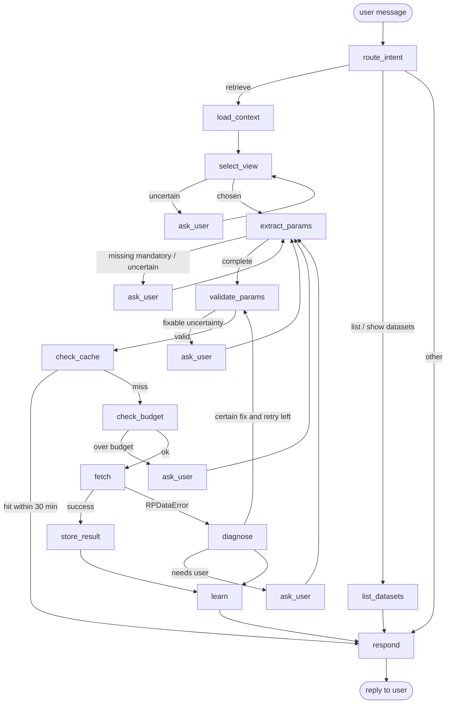

# rp_agent: Specification

**Status:** Draft v0.1, for review. Nothing is implemented yet.
**Purpose:** A LangGraph agent that turns a user's plain-language request into one correct, economical `rpdata.get_data` call. It keeps the resulting DataFrame in a store and hands the user back an ID. It learns from each call and each clarification, so it asks fewer questions and makes fewer bad calls over time.

---

## 1. Goals and non-goals

### Goals
- **Retrieve data** from `rpdata` for a request such as *"Tier1 breaches on the equity desks last week"*.
- **Pick a view.** The view must be one of `rpdata.list_views()`. If the agent is unsure, it asks the user.
- **Pick parameters.** Every mandatory parameter must be filled. Closed-list parameters are validated before the call where possible. If the agent is unsure, it asks the user.
- **Treat `get_data` as expensive.** Call it only when the view and parameters are settled. Never call it to explore, and never call it twice for the same data within 30 minutes.
- **Store every result** in an in-memory store under a dataset ID. Each entry records the exact view, the exact parameters and the retrieval time. All four are returned to the user.
- **Reuse recent results.** If the same view and parameters were retrieved within the last 30 minutes, return the existing dataset ID and do not call `get_data`.
- **Learn.** Keep short, human-readable notes on views and parameters (formats, quirks, user vocabulary, worked examples). Load them on later requests so the agent gets it right first time more often.

### Non-goals (v1)
- **No changes to `rpdata`.** `rpdata` is a dependency, not something this project edits. Changes this project would like are listed in §12 as proposals. They need explicit approval before anyone makes them.
- No analysis, charting or summarising of the DataFrame contents. The agent retrieves data; it does not interpret it. (It may report the row count and columns.)
- No persistent data store. The store is in memory and is lost when the process ends. The interface allows a persistent store later.
- No joins across views. For example, adding `depth` from `ViewHierarchy` onto `ViewLimits` is out of scope.
- No multi-user access control.

---

## 2. Technology

| Item | Choice |
|---|---|
| Language | Python ≥ 3.10 (matches `rpdata`) |
| Agent framework | `langgraph` (state graph, checkpointer, `interrupt` for questions to the user) |
| LLM interface | `langchain-core` chat models with structured output (Pydantic schemas) |
| Default LLM | An Anthropic Claude model via `langchain-anthropic`, chosen by config / env var (`RP_AGENT_MODEL`). Any LangChain chat model that supports structured output can be used |
| Data dependency | `rpdata` as a package dependency, e.g. `rpdata @ git+https://github.com/PaeoniaCommon/rpdata.git@<tag>` |
| Other runtime deps | `pandas`, `pydantic` |
| Dev deps | `pytest`, `ruff` |
| Packaging | `pyproject.toml`, `src/` layout (as in `rpdata`) |

---

## 3. Key design decisions

1. **`get_data` is not an LLM tool.** A free-form ReAct agent that can call `get_data` whenever it likes would over-query. Instead the agent is an explicit LangGraph state graph. The LLM is used only for judgement: choosing the view, extracting parameters and writing notes. Every call to `get_data` goes through one deterministic node (`fetch`), which sits behind the validation, cache and budget checks.
2. **One gateway to `rpdata.get_data`.** Only `DataGateway` (§6.1) imports and calls `rpdata.get_data`. It enforces the call budget and logs every call. Tests put a spy on it to count calls.
3. **Deterministic checks wherever possible.** Mandatory parameters, view names, closed-list values, formats, cache lookup and budget are plain Python, not LLM judgement.
4. **Ask rather than guess.** Any uncertainty that could change the result goes back to the user as a question (via LangGraph `interrupt`). A wasted question costs less than a wasted `get_data` call.
5. **DataFrames never enter the LLM context.** The LLM sees dataset metadata (ID, view, params, shape, columns), never the rows. This keeps prompts small and data out of the model.
6. **Learning is plain text on disk.** Notes are Markdown files that a person can read, edit and commit to git (§8).

---

## 4. What the agent uses from `rpdata` (today)

The agent relies only on the public `rpdata` API:

| Call | Used for | Cost |
|---|---|---|
| `rpdata.list_views()` | The only allowed view names | Free, cached at start-up |
| `rpdata.get_view(name)` | `description`, `mandatory_params`, `optional_params`, `columns` | Free, cached at start-up |
| `rpdata.list_params()` | `Parameter` metadata: `dtype`, `description`, `format`, `allowed_values` | Free, cached at start-up |
| `rpdata.get_data(view, **params)` | The retrieval itself | **Expensive**: budgeted, cached, logged |
| `rpdata.RPDataError` and subclasses | Classifying failures for learning (§8.3) | n/a |

Together these calls make up the **catalogue**. It is built once at start-up and shown to the LLM in compact form.

**What `rpdata` does not provide today** (see §12):
- No public "validate these parameters for this view without fetching" function. `get_data` validates internally and raises. (`Parameter.validate` exists on the `Parameter` objects, but `rpdata`'s own spec says there is no client-side validation, so this spec does not rely on it unless the owner approves. See open question Q1.)
- No closed list of nodes. `node` has `allowed_values=None`. Only `limit_level` and `risk_factor` publish their allowed values.
- No parameter defaults in the metadata (for example, `max_depth` defaults to `'max'`).

---

## 5. Agent flow

### 5.1 Graph



`learn` also runs after any `ask_user` answer that resolved an ambiguity (§8.3). For readability that edge is not drawn.

### 5.2 Nodes

| Node | Kind | Responsibility |
|---|---|---|
| `route_intent` | LLM (small) | Classify the message: new retrieval, refine the previous retrieval, list or describe stored datasets, or other. A refinement ("same but Tier0 only") starts from the previous request's view and params |
| `load_context` | Deterministic | Load the catalogue, the general notes, the recent store entries (for dedup hints) and the view-selection notes |
| `select_view` | LLM + check | Choose a view (§5.3). The output must be in `list_views()`, which is enforced by an enum in the schema and checked again in code |
| `extract_params` | LLM + check | Fill the chosen view's parameters (§5.4). Loads the notes for that view and its parameters only |
| `validate_params` | Deterministic | Pre-flight checks (§5.5). No `get_data` call |
| `check_cache` | Deterministic | Look up the canonical request key in the store (§7.3) |
| `check_budget` | Deterministic | Enforce the call limits (§6.2) |
| `fetch` | Deterministic | Call `DataGateway.fetch` (the only `get_data` path) |
| `store_result` | Deterministic | Save the DataFrame and metadata, and get a dataset ID |
| `diagnose` | Deterministic + LLM | Classify the `RPDataError`, decide whether a certain fix exists (§6.3), and draft a learning note |
| `learn` | LLM + check | Write, merge or confirm notes (§8) |
| `ask_user` | `interrupt` | Ask one bundled question and resume with the answer |
| `respond` | Template | Reply with the dataset ID, view, params, retrieval time, whether it was reused, and the shape (§9) |

### 5.3 View selection

The LLM gets the user request, the catalogue (name, description, mandatory and optional params, columns for each view), the view-selection notes and past worked examples. It returns:

```python
class ViewChoice(BaseModel):
    view: Literal[<names from rpdata.list_views()>] | None
    confidence: Literal["high", "medium", "low"]
    alternatives: list[str]          # other plausible views, also from list_views()
    reason: str                      # one sentence, used in questions and logs
```

**Decision rule:**
- Proceed if `view` is set, `confidence == "high"` and `alternatives` is empty. A note or worked example that maps this kind of request to a view counts as high confidence.
- Otherwise ask the user. List the candidate views, each with its one-line description, and let them choose. The user can only pick from views in `list_views()`. If they name something else, the agent says it is not available and asks again.
- A view name the user gives explicitly and correctly is always accepted.

### 5.4 Parameter extraction

The LLM gets the request, the view's parameter metadata (dtype, description, format, allowed values), the notes for the view and each of its parameters, and the current date. It returns one entry per parameter it wants to set:

```python
class ParamValue(BaseModel):
    name: str                        # must be in the view's mandatory + optional params
    value: str | int | float
    source: Literal["user_explicit", "user_implied", "note", "default", "guess"]
    note_ids: list[str]              # notes relied on, for confirming or demoting them later
    confidence: Literal["high", "medium", "low"]

class ParamExtraction(BaseModel):
    params: list[ParamValue]
    questions: list[str]             # anything the model itself is unsure about
```

**Decision rule:**
- Every mandatory parameter must have a value. If one is missing, ask. The agent never invents a value for a mandatory parameter without a source.
- A value with `source == "guess"` or `confidence == "low"` is never sent to `get_data`. Ask instead.
- Relative dates ("last week", "yesterday", "latest") are resolved to explicit `yyyy-mm-dd` strings. If a note says the data only covers a set period (for example, it ends 2026-08-31) and the resolved date is outside it, ask before calling. Otherwise the call would just return an empty DataFrame.
- Optional parameters are set only when the request implies them. The agent does not add filters the user did not ask for. The exception is a filter a note says is needed to avoid a known failure (for example, the MASTER timeout). That filter is surfaced as a question, not added silently, because it changes the result.
- All questions from this step, and from §5.5, go to the user as **one** bundled message, not one at a time.

### 5.5 Parameter validation (pre-flight, no `get_data`)

`ParamValidator` runs checks in this order and collects every problem, not just the first:

| # | Check | Source of truth | On failure |
|---|---|---|---|
| 1 | View is in `list_views()` | `rpdata` | Back to `select_view` |
| 2 | No parameter outside the view's mandatory + optional list | `rpdata.get_view` | Drop it and tell the user, or ask if it looked intentional |
| 3 | All mandatory parameters present | `rpdata.get_view` | Ask |
| 4 | Closed-list values are in `Parameter.allowed_values` (today: `limit_level`, `risk_factor`) | `rpdata.list_params` | Normalise if there is exactly one case-insensitive or whitespace-insensitive match (for example `tier1` → `Tier1`), and report the change to the user. Otherwise ask, offering the allowed values |
| 5 | Values match learned formats and value lists (for example, node names are upper case; dates are `yyyy-mm-dd` strings) | Knowledge notes (§8) | Normalise when the note's rule is marked `certain`, otherwise ask |
| 6 | Checks from `rpdata` itself, **if available** | `rpdata.validate_params` (proposed, §12) | Treated like steps 2–4 |

- Step 6 is found by feature detection (`hasattr(rpdata, "validate_params")`). When the function is added to `rpdata`, the agent uses it with no code change. Until then steps 1–5 run alone.
- **Not every parameter can be validated.** For example, `limit_id`, `limit_group` and `user_id` have a regex format but no closed list; an unknown but well-formed value returns an empty DataFrame. Such parameters are passed through. If the user gave the value explicitly, that is enough.
- Learned value lists (for example, nodes seen to succeed before) are **advisory**. A value that is not in the list triggers a question only if it also looks unlike every known value (for example, it is not a case variant of one). The learned list is never treated as complete.

---

## 6. Calling `get_data`

### 6.1 `DataGateway`
- The only code path that calls `rpdata.get_data`.
- Passes parameters as keyword arguments exactly as stored in the canonical request (§7.3), so what is stored is exactly what was sent.
- Records each call in `logs/get_data_calls.jsonl`: timestamp, thread ID, view, params, outcome (`ok`, `empty`, `error`), error class and message, duration, and row count.
- Exposes counters that tests and metrics can read.

### 6.2 Budget

| Setting | Default | Meaning |
|---|---|---|
| `max_calls_per_request` | 2 | One first attempt plus at most one corrective retry per user request |
| `max_calls_per_session` | 20 | A safety net across a whole conversation thread |
| `allow_retry_without_user` | `true` | A retry is only allowed when §6.3 marks the fix as certain |

When a budget is used up, the agent does not call `get_data`. It explains what failed and asks the user how to continue.

### 6.3 Handling errors and empty results

| Outcome | Example | Agent behaviour |
|---|---|---|
| `UnknownViewError` | should never happen after §5.5 | Treat as a bug: log it, ask the user |
| `UnexpectedParameterError`, `MissingParameterError` | should never happen after §5.5 | Treat as a bug in the catalogue handling: log it, ask the user |
| `InvalidParameterError` / `UnknownNodeError` with a **certain** fix | `current_date='01/07/2026'`: the message says `yyyy-mm-dd`, and the value can be reformatted without ambiguity. `node='equities'` → `EQUITIES` | Write a note, apply the fix, re-validate, retry once (within budget), and tell the user what was changed |
| `InvalidParameterError` / `UnknownNodeError` with **no** certain fix | `node='EQUITY'`, which could be `EQUITIES` or an `EQ_*` node | Write a note, ask the user |
| `ViewTimeoutError` | `node='MASTER'` with no other filter | Write a note about the rule from the error message. **Do not** add a filter automatically, because that changes the data. Ask the user which filter to add, with suggestions |
| Empty DataFrame | weekend date, date outside the data period, node with no limits | This is a valid result. Store it and return its ID, and say it is empty. Draft a note if the cause is identifiable (for example, a weekend or out-of-period date). Do not retry |
| Any other exception | | Do not retry. Log it and report it to the user |

A fix counts as **certain** only if all of these hold: it keeps the user's intent, it has exactly one candidate, and it is justified by the error message or a `certain` note. Ambiguous date formats such as `01/07/2026` (1 July or 7 January) are **not** certain unless the user's convention is recorded in a note.

---

## 7. Data store

### 7.1 Interface

```python
class DataStore(Protocol):
    def put(self, df: pd.DataFrame, request: CanonicalRequest, retrieved_at: datetime,
            original_request: str) -> DatasetRecord: ...
    def get(self, dataset_id: str) -> DatasetRecord: ...                 # KeyError if unknown
    def get_df(self, dataset_id: str) -> pd.DataFrame: ...
    def find_recent(self, request: CanonicalRequest, within: timedelta,
                    now: datetime) -> DatasetRecord | None: ...
    def list(self) -> list[DatasetRecord]: ...
```

v1 ships `InMemoryDataStore`: a dict held by the agent instance and shared by every thread (conversation) in that process. It takes an injectable clock for tests.

### 7.2 Record

| Field | Type | Notes |
|---|---|---|
| `dataset_id` | `str` | `ds_` plus 8 random hex characters, e.g. `ds_7f3a2c91`. Unique within the store |
| `view` | `str` | Exact view name passed to `get_data` |
| `params` | `dict` | Exact parameters passed to `get_data` (after normalisation) |
| `retrieved_at` | `datetime` | Time `get_data` returned, timezone-aware UTC. Shown to the user in ISO 8601 |
| `row_count` | `int` | |
| `columns` | `tuple[str, ...]` | |
| `original_request` | `str` | The user's wording, for audit and for learning examples |
| `df` | `pandas.DataFrame` | Stored as returned. Callers get a copy, so the stored frame cannot be changed |

### 7.3 Canonical request and the 30-minute reuse rule

- `CanonicalRequest` = `(view, params)`. `params` drops `None` values, sorts keys, and normalises types (for example, `85` and `85.0` for utilisation become the same value). The cache key is a stable JSON serialisation of it.
- **Reuse rule:** before any `get_data` call, `check_cache` calls `find_recent(request, within=30 min, now)`. If a record exists whose `retrieved_at` is within the last 30 minutes, the agent returns that record's ID, view, params and retrieval time, says it was reused, and **does not** call `get_data`.
- The window is measured from the original `retrieved_at`. Reusing a record does not refresh it.
- The 30-minute window only controls reuse. Older records stay retrievable by ID until the process ends.
- If the user explicitly asks for fresh data ("refresh", "re-pull"), the cache is skipped and a new record is created. The old one is kept.
- **v1 match is exact** on the canonical request. Equivalences such as "leaving out `max_depth` equals `max_depth='max'`" are applied only when they are recorded as `certain` equivalence notes (§8.2). Serving a request from a *broader* cached dataset (a subset) is out of scope for v1 (see Q4).

---

## 8. Learning

### 8.1 What is learned

| Kind | Example | Used by |
|---|---|---|
| Format rule | "`current_date` must be a `yyyy-mm-dd` string; `2026/07/01` is rejected" | `extract_params`, `validate_params` |
| Value rule | "Node names are upper case and case-sensitive" | `validate_params` |
| Observed valid values | Nodes that have succeeded: `EQUITIES`, `EQ_EMEA`, … | `validate_params` (advisory) |
| User vocabulary / aliases | "'equity desk' → `node=EQUITIES`"; "'breaches' → `min_utilisation=100`" | `extract_params` |
| View-selection hints | "Requests about 'utilisation', 'usage' or 'breach' → `ViewUtilisations`" | `select_view` |
| Quirks / failure rules | "`node=MASTER` with no filter other than dates times out; an integer `max_depth` or any other filter avoids it" | `extract_params`, `validate_params` |
| Data coverage | "Data covers business days 2026-06-01 to 2026-08-31; weekends return empty" | `extract_params` |
| Equivalences | "Omitting `max_depth` is the same as `max_depth='max'`" | `check_cache` |
| Worked examples | request text → view + params that succeeded first time | `select_view`, `extract_params` (few-shot) |

### 8.2 Files

```
knowledge/
├── general.md                  # cross-cutting notes (date conventions, data coverage)
├── views/
│   ├── ViewLimits.md
│   └── ...
└── params/
    ├── node.md
    ├── current_date.md
    └── ...
```

The directory can be set in config (`RP_AGENT_KNOWLEDGE_DIR`). It starts empty, apart from optional human-written seed notes. Each file is Markdown with a small YAML front matter block. The front matter holds the machine-usable facts; the body holds short notes for the LLM:

```markdown
---
param: node
aliases:                     # user phrase -> value
  "equity desk": EQUITIES
observed_values: [EQUITIES, EQ_EMEA, CREDIT]
rules:
  - id: node-001
    kind: value_rule
    text: "Upper case and case-sensitive. 'equities' raises UnknownNodeError."
    certainty: certain       # certain | likely | tentative
    source: rpdata_error     # rpdata_error | rpdata_metadata | user | success | human
    created: 2026-09-27
    last_confirmed: 2026-09-27
    uses: 3
---
- Case-only mistakes can be fixed automatically (unique upper-case match).
- `EQUITY` is not a node. Ask whether the user means `EQUITIES` or one of the `EQ_*` nodes.
```

**Loading.** Only `general.md`, the notes for the candidate views and the notes for the chosen view's parameters are put into a prompt. Nothing else is loaded.

**Size limits.** At most 25 rules per file and about 2 KB of body text. At most 10 worked examples per view, most recent first. When a file goes over the limit, `learn` merges it: duplicates are combined and the least-used `tentative` rules are dropped. Notes with `source: human` are never deleted or rewritten by the agent.

**Content rule.** Notes describe *how to query*. They never contain rows or values from a DataFrame (such as positions or utilisations), except for reference values such as node names.

**Concurrency.** Writes are atomic (write a temporary file, then rename) and serialised by a process-level lock.

### 8.3 When learning happens

| Trigger | What is written | Certainty |
|---|---|---|
| `rpdata` error with a clear message (§6.3) | A format, value or quirk rule taken from the message | `certain` |
| Catalogue metadata at start-up (e.g. `Parameter.format`) | Not written: it is always read live from `rpdata` | n/a |
| User answers a clarification | Alias, view hint, or convention (for example, "dates are dd/mm") | `likely`. Becomes `certain` after it is used successfully in a later call |
| Successful call where the params came from notes | `uses += 1`, `last_confirmed` updated on each note used (via `note_ids`) | Promotes `likely` to `certain` after 2 confirmations |
| Successful call that needed no clarification | A worked example for the view | n/a |
| Empty result with an identifiable cause | Coverage or quirk rule | `likely` |
| Call fails although it followed a note | The note is demoted one level, or removed if it was `tentative` | n/a |

`learn` uses the LLM to phrase the note and pick the file. A deterministic check then enforces the schema, the size limits, the content rule and dedup (same `kind` and same meaning on the same parameter or view). Every change is logged.

### 8.4 How learning cuts clarifications (and why they never reach zero)

- Aliases and view hints turn requests that needed a question into `source: note, confidence: high` values, which pass the decision rules in §5.3 and §5.4 without asking.
- Format and value rules let `validate_params` fix problems before the call, not after a failed call.
- Coverage and quirk rules stop calls that would return empty or time out.
- Questions are still asked when the request really is ambiguous, when a mandatory value has no source, when a fix would change the result (for example the MASTER filter), or when a note contradicts what the user just said. **What the user says explicitly always beats a note.**

---

## 9. User-facing behaviour

### 9.1 Python API

```python
from rp_agent import RPAgent

agent = RPAgent()                                   # model, store and knowledge dir from config
reply = agent.chat("Tier1 breaches on equities on 28 Aug 2026", thread_id="t1")
reply.text                                          # message to show the user
reply.datasets                                      # list[DatasetRecord] produced or reused this turn
reply.question                                      # set if the agent is waiting for an answer

agent.chat("EQUITIES and all its sub-nodes", thread_id="t1")   # answer resumes the interrupted graph
df = agent.store.get_df("ds_7f3a2c91")
```

LangGraph's in-memory checkpointer (`MemorySaver`) keeps per-thread state, so an answer to a question resumes the graph where it stopped.

### 9.2 CLI
`rp-agent chat` starts an interactive loop. `/datasets` lists stored datasets, `/show <id>` prints a dataset's metadata and first rows (read from the store, not through the LLM), and `/refresh` forces the next request to skip the cache.

### 9.3 Reply format

New retrieval:
```
Retrieved dataset ds_7f3a2c91 (new query)
  View:          ViewUtilisations
  Params:        node='EQUITIES', current_date='2026-08-28', limit_level='Tier1', min_utilisation=100
  Retrieved at:  2026-09-27T10:14:03Z
  Result:        4 rows × 14 columns
  Adjustments:   limit_level 'tier1' → 'Tier1' (case)
```

Reused:
```
Reusing dataset ds_7f3a2c91 — the same view and parameters were retrieved 12 minutes ago (no new query)
  View:          ViewUtilisations
  Params:        node='EQUITIES', current_date='2026-08-28', limit_level='Tier1', min_utilisation=100
  Retrieved at:  2026-09-27T10:14:03Z
```

Question (one bundled message, with options where there is a closed list):
```
Before I query, I need two things:
1. Which data do you want?
   a) ViewLimits — risk limit definitions
   b) ViewUtilisations — daily position and utilisation against each limit
2. Which date? The data I have seen covers 2026-06-01 to 2026-08-31.
```

---

## 10. Package layout

```
rp_agent/
├── pyproject.toml
├── README.md
├── SPEC.md
├── knowledge/                  # learned notes (committed; seed notes optional)
├── src/rp_agent/
│   ├── __init__.py             # RPAgent, DatasetRecord
│   ├── config.py               # settings (model, budget, TTL, paths) from env / defaults
│   ├── catalogue.py            # wraps list_views / get_view / list_params, cached
│   ├── gateway.py              # DataGateway: sole caller of rpdata.get_data, budget, call log
│   ├── store.py                # DataStore protocol, InMemoryDataStore, DatasetRecord
│   ├── canonical.py            # CanonicalRequest, cache key, equivalences
│   ├── validation.py           # ParamValidator (§5.5), rpdata feature detection
│   ├── knowledge.py            # KnowledgeBase: load / query / write / merge notes
│   ├── schemas.py              # Pydantic models for structured LLM output
│   ├── prompts.py
│   ├── state.py                # LangGraph state TypedDict
│   ├── nodes/                  # one module per graph node (§5.2)
│   ├── graph.py                # builds and compiles the StateGraph
│   └── cli.py
├── logs/                       # get_data call log (git-ignored)
└── tests/
```

---

## 11. Acceptance criteria / test plan

Tests use a scripted fake chat model (so they run with no network access or API key) and a spy on `DataGateway`, and run against the real `rpdata` package.

**Over-query protection**
- A request that resolves to a view not in `list_views()` never reaches `get_data`.
- A request with a missing mandatory parameter causes a question and no `get_data` call.
- A `guess`/`low` confidence parameter causes a question and no call.
- A closed-list value with no unique normalisation (`limit_level="Tier 3"`) causes a question and no call.
- `get_data` is called at most `max_calls_per_request` times per request, including retries.
- No `get_data` call is made for a `list datasets` request.

**Store and reuse**
- A successful call stores a record with an ID, the exact view and params sent, a UTC `retrieved_at` and the DataFrame. The reply contains all four.
- The same request 29 minutes later (fake clock) returns the same ID and makes **zero** `get_data` calls.
- The same request 31 minutes later makes one new call and returns a new ID. The old ID is still retrievable.
- Parameters given in a different order or form (`85` and `85.0`) hit the cache.
- An explicit refresh skips the cache.
- An empty result is stored and returned with an ID.

**Errors and learning**
- `node="equities"` (with no notes): the call raises `UnknownNodeError`, a `certain` note is written to `params/node.md`, the case fix is applied, and a single retry succeeds.
- The same request in a new session (notes present): `validate_params` fixes the case **before** the call, so there is exactly one `get_data` call and no error.
- `ViewLimits` with `node="MASTER"`: timeout → note → question (no automatic filter). In a new session, the same request causes a question **before** any call.
- A user clarification "the equity desk means EQUITIES" is saved as an alias. A later request using "equity desk" needs no question.
- A note that leads to a failed call is demoted.
- Notes stay within the size limits after 50 synthetic learning events. `human` notes are unchanged.

**Learning curve (evaluation script, not a unit test)**
- `scripts/eval_learning.py` runs a fixed set of ~20 realistic requests (with scripted user answers) twice: first with an empty `knowledge/`, then with the notes from the first run. It reports, for each run: questions per request, `get_data` calls per request, error rate and cache hits. The second run must show fewer questions and fewer failed calls. This needs a real LLM and is run by hand.

---

## 12. Proposed `rpdata` additions (not to be made without approval)

These would make the agent more efficient. The agent is designed to work without them and to pick them up by feature detection when they exist.

| # | Proposal | Why |
|---|---|---|
| R1 | `rpdata.validate_params(view, **params) -> dict` — runs `get_data`'s validation steps 1–7 (including the MASTER rule) without querying, and returns the normalised params or raises the same errors | Lets the agent find every validation error before the expensive call |
| R2 | Publish the node list: `allowed_values` on the `node` parameter, or `rpdata.list_allowed_values("node")` | `node` is the most error-prone parameter and today can only be checked by learning or by calling `ViewHierarchy` |
| R3 | Add `default` to `Parameter` (e.g. `max_depth` → `'max'`) | Lets the cache treat "omitted" and "default" as the same request without a learned note |
| R4 | Expose the data coverage (first/last business date) | Stops out-of-period date queries without needing to learn the period |

---

## 13. Implementation milestones
1. Project skeleton, `pyproject.toml` with `rpdata` dependency, config, tooling (ruff, pytest).
2. `catalogue`, `canonical`, `store`, `gateway`, with unit tests (no LLM).
3. `validation` and `knowledge` (read, write, merge, limits), with unit tests.
4. Graph nodes and `graph.py` with `interrupt` clarification, tested end-to-end with the fake chat model.
5. Learning triggers (§8.3) and the scenarios in §11.
6. CLI, README and the learning evaluation script.

---

## 14. Open questions (for review)
1. **Q1 — `Parameter.validate`:** `rpdata`'s `Parameter` objects already have a public `validate(view_name, value)` method. Should the agent use it now as an interim pre-flight check (it catches format and closed-list errors, including unknown nodes)? Or should the agent treat `rpdata` as a black box, as the real service would be, and wait for R1? **Draft assumption:** black box; do not use it.
2. **Q2 — Store scope:** should the 30-minute reuse apply across all threads in the process (the draft assumption), or only within one conversation?
3. **Q3 — Several views per request:** a request like "limits and utilisations for EQUITIES" needs two `get_data` calls. The draft assumes one dataset per request: the agent says so, retrieves the first and offers the second. Should it plan and run several retrievals in one turn (each still validated, cached and budgeted)?
4. **Q4 — Subset reuse:** should a request that is a strict subset of a recent broader dataset (for example `limit_level='Tier1'` when the unfiltered data for the same node and date is cached) be served by filtering the cached DataFrame instead of calling `get_data`? That saves calls but makes the rule "the stored params are exactly what was sent" harder to keep. **Draft assumption:** out of scope for v1.
5. **Q5 — Should `knowledge/` be committed** to the repo (shared learning, reviewable in PRs) or kept per user/machine? **Draft assumption:** committed.
6. **Q6 — Confirm before calling:** should the agent always show the final view and params and wait for a "go" before the first `get_data` call of a request, at least until notes for that view exist? That is safer, but it adds a round trip. **Draft assumption:** no. It only asks when uncertain.
